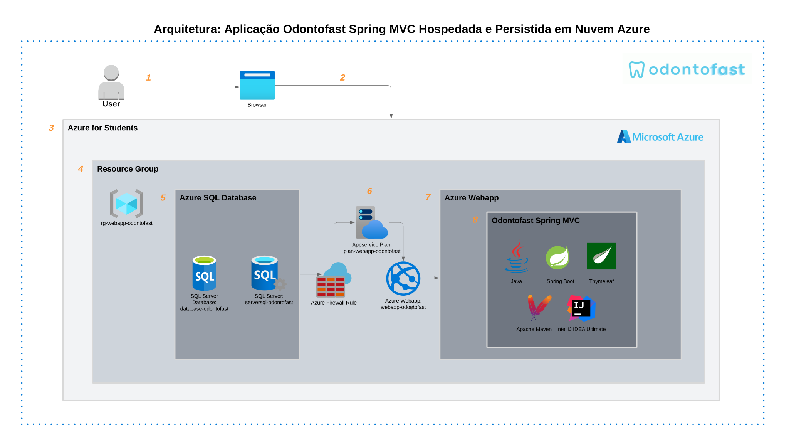

# 🦷 Odontofast
 
O projeto Odontofast em Spring MVC, é uma aplicação web MVC desenvolvida como parte da 3ª Sprint do Challenge para a Odontoprev. Este projeto utiliza o framework Spring Boot com Thymeleaf para criar templates dinâmicos, integrado a um banco de dados SQL Server para persistência de dados. A aplicação visa facilitar a gestão da rotina de dentistas com seus pacientes, oferecendo funcionalidades como cadastro, login, atualização de perfil, dashboard e gerenciamento de agendamentos.
 
## ☁️ Hospedagem na Nuvem Azure
 
Toda a infraestrutura do projeto está hospedada na nuvem Azure utilizando serviços como Azure Web App e SQL Database.
 
## 🚀 Tecnologias Utilizadas

- **Backend**: Java 21, Spring Boot  
- **Banco de Dados**: SQL Server (Azure SQL Database)  
- **IDE**: IntelliJ IDEA Ultimate  
- **Hospedagem**: Azure Web App  
- **Build e Deploy**: Maven, Azure CLI  

## 🛠️ Requisitos

- Java 21  
- Maven  
- Azure CLI  
- Conta Azure (recomendada Azure for Students)  
- Git  
- IntelliJ IDEA Ultimate  

## 📊 Arquitetura



 
## 🔌 Dependências Principais
 
O arquivo `pom.xml` contém as dependências necessárias para o projeto:
 
- **Spring Boot Starter Web**: Para criar a aplicação web
- **Spring Boot Starter Data JPA**: Para acesso a dados com JPA
- **Microsoft SQL Server Driver**: Para conexão com o SQL Server
- **Azure WebApp Maven Plugin**: Para facilitar o deploy no Azure através do IntelliJ IDEA Ultimate
- **Spring Boot Starter Thymeleaf**: Para templates HTML
 
## ⚙️ Configuração da Infraestrutura no Azure
Dentro da Azure, no Cloud Shell, efetua-se os seguintes comandos:
 
### 1. Criar Grupo de Recursos
 
```bash
az group create --name rg-webapp-odontofast --location eastus2
```
 
### 2. Configurar o SQL Server
 
```bash
# Criar SQL Server
az sql server create --resource-group rg-webapp-odontofast --name serversql-odontofast --location eastus2 --admin-user sqladmin --admin-password Fiap@2ds2025
 
# Criar a base de dados
az sql db create --resource-group rg-webapp-odontofast --server serversql-odontofast --name database-odontofast --service-objective S0
 
# Configurar regras de firewall (permitir todos os IPs)
az sql server firewall-rule create --resource-group rg-webapp-odontofast --server serversql-odontofast --name AllowAllIps --start-ip-address 0.0.0.0 --end-ip-address 255.255.255.255
```
 
### 3. Configurar o Azure Web App
 
```bash
# Criar plano de serviço
az appservice plan create --name plan-webapp-odontofast --resource-group rg-webapp-odontofast --sku FREE
 
# Criar o Web App
az webapp create --resource-group rg-webapp-odontofast --plan plan-webapp-odontofast --name webapp-odontofast
 
# Configurar string de conexão com o banco de dados
az webapp config connection-string set \
    --resource-group rg-webapp-odontofast \
    --name webapp-odontofast \
    --settings "DefaultConnection=Server=tcp:serversql-odontofast.database.windows.net,1433;Initial Catalog=database-odontofast;Persist Security Info=False;User ID=sqladmin;Password=Fiap@2ds2025;MultipleActiveResultSets=False;Encrypt=True;TrustServerCertificate=False;Connection Timeout=30;" \
    --connection-string-type SQLAzure
```
 
## 📋 Instruções de Como Executar a Aplicação  
 
### 1. Clone do Repositório
 
```bash
git clone https://github.com/felipetosma/Sprint-3---DevOps-Tools-e-Cloud-Computing.git
```
 
### 2. Verificação do Ambiente
 
Certifique-se de ter Java 21 e Maven instalados e configurados:
 
```bash
java --version
mvn --version
```
 
## 🚀 Build e Deploy
 
### Compilando o Projeto
 
```bash
mvn clean package
```
 
### Realizando Deploy no Azure
 
```bash
mvn azure-webapp:deploy
```
 
## 🌐 Acessando a Aplicação
 
Após o deploy, a aplicação estará disponível em:
 
- **Login**: https://webapp-odontofast.azurewebsites.net/dentista/login
- **Cadastro**: https://webapp-odontofast.azurewebsites.net/dentista/cadastro
- **Home**: https://webapp-odontofast.azurewebsites.net/dentista/home
 
## 📝 Gerenciamento do Banco de Dados
 
Para acessar e gerenciar o banco de dados diretamente no Azure:
 
1. Acesse o portal do Azure
2. Navegue até o grupo de recursos `rg-webapp-odontofast`
3. Selecione o banco de dados `database-odontofast`
4. Use o "Editor de Consultas" no menu lateral
5. Insira as credenciais:
   - Usuário: `sqladmin`
   - Senha: `Fiap@2ds2025`

## 🎥 Vídeo Explicativo e Demonstrativo
[Clique aqui](https://youtu.be/rpMG-N7bPMw
 )
 
## 👥 Integrantes

- Felipe Amador - RM553528
- Leonardo Oliveira - RM554024
- Sara Sousa - RM552656
